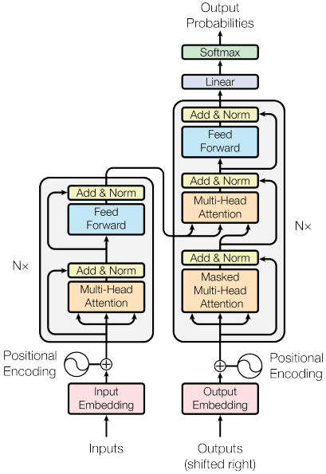

# PyFormer

PyFormer is a transformer machine translation model that converts **english sentences to python code**.

## Dataset

The dataset is a small set of english text and their respective python code, approx 4000 entries. You can download the dataset [here](https://docs.google.com/document/d/1ztL3HDsDBb688PnaglBpfRLUZpZFNndHL90e23JIhy4/edit?usp=sharing)

## Data Cleaning and Preparation
The data was cleaned manually by removing unneccessary indentation and comments. 

The data needs to be tokenized  properly before feeding it to the model. The english sentences were tokenized using spacy.
To tokenize the python code, a **lexical analyzer tool** is written which tokenizes the code according to python. 
If you wish to use the model for your language you can modify the tool [here](https://github.com/vpsingh22/PyFormer/blob/master/data/lexical_analyzer.py)

## Embeddings Training
The embeddings are trained using glove. If you wish not to train the embeddings you can set embeddings_training to False in config.
Glove uses weighted mean square error to find the corelation between the tokens for the vocabulary. The trained embeddings weights are directly copied to the Decoder embeddings layer of the model.

## Model Architecture

The model uses a Encoder Decoder architecture with Multihead Attention. 
 
Click [here](https://dev.to/vpsingh22/detailed-explanation-to-attention-is-all-you-need-1ff4) for clear explanation and visualization of the architecture.

## Results
The model gives pretty good results. 
 
The above is a sample example. You can view the results of 35+ examples [here](https://github.com/vpsingh22/PyFormer/blob/master/sample_outputs/README.md)

## Metrics
The model uses cross entropy loss function.  
The model achieves a minimum validation loss of 1.4 at 15th epoch.
The validation perplexity is 4.1

The model achieves a minimum training loss of 0.2 at 50th epoch.
The training perplexity is 1.2

The model was also tested for bleu_score and word error rate. Since the code length depends on logic, both of which are not suitable metrics for the problem.
